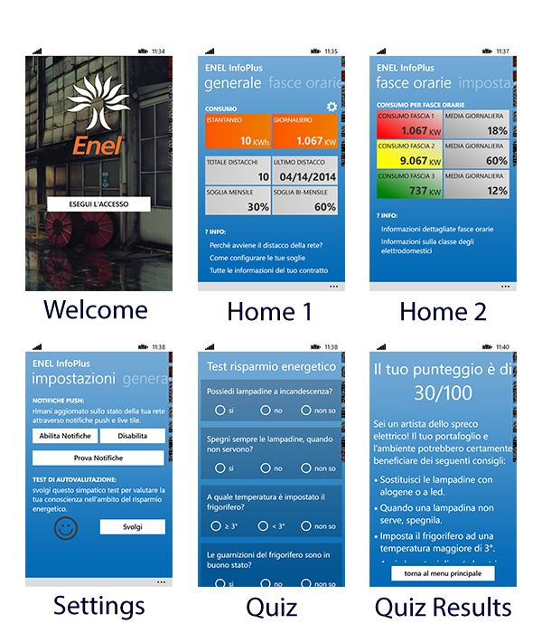

# Enel Smart Info

Enel Smart Info is a Windows Phone 8.0 app presented at Microsoft hackathon //Publish, in May 2014.
The goal of the app was portraying a possible interface for the smart management of a house electricity, also through IoT devices and similar.

The app is fully localized in Italian.

Below here, a series of screenshots that show the content of the app:

## How is it built?

The app relies on the following plugins and extensions:

* Telerik for Windows Phone 8.0
* Newtonsoft Json
* Cortana APIs
 
The app features charts and plots together with an integration with Cortana voice commands. Also, the app implements automated notifications in order to warn the user of possible critical events such a shortage of electrical power.
